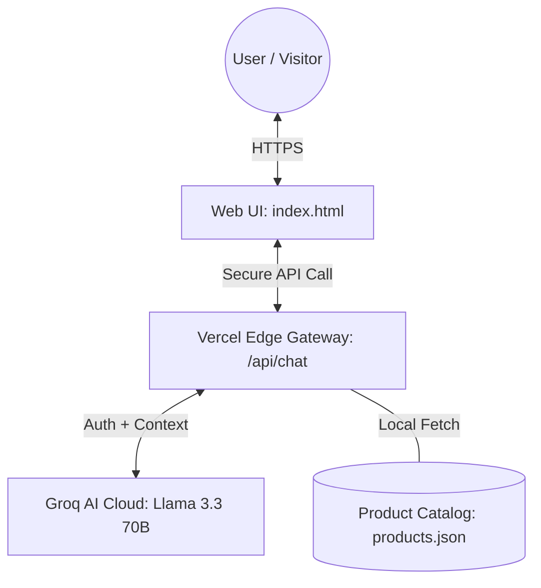

# SP4 Ameya AI Product Assistant

An intelligent, brand-aligned AI ambassador designed for the SP4 Ameya healthcare ecosystem. This system leverages the Groq Llama 3.3 70B model to provide high-speed, clinical-grade product information to users.

## 🏗️ Technical Architecture
The system is built with a **Security-First** approach, ensuring that all AI processing and API keys are handled server-side to prevent exposure.

### System Block Diagram

## 🧠 AI Intelligence (Powered by Groq)
The heart of the assistant is the **Groq Llama 3.3 70B Versatile** model. 

### Why Groq?
- **Ultra-Low Latency**: Groq's LPU™ (Language Processing Unit) delivers near-instant response times, crucial for medical and professional environments.
- **Deep reasoning**: The 70B parameter model allows the assistant to understand complex medical IoT contexts beyond simple keyword matching.

### Intelligence Logic
Rather than using static predefined responses, the system uses **Dynamic Prompting**:
1. **Context injection**: Every user query is paired with the latest data from `products.json`.
2. **Conversational Guardrails**: The AI is programmed to be professional yet warm, distinguishing between casual greetings and deep technical enquiries.
3. **Cross-Product Reasoning**: The model is instructed to identify relationships between different SP4 rehabilitation devices to provide holistic health advice.

## 🎨 Design Identity
- **Themes**: Supports adaptive Light (Cream) and Dark (Midnight Purple) modes.
- **Typography**: Uses **Playfair Display** for high-end serif headings and **Outfit** for clean, modern readability.
- **User Experience**: Features interactive product chips, WhatsApp integration for direct clinical enquiries, and real-time typing indicators.

## 📁 Core Components
- `index.html`: The interactive frontend and design system.
- `api/chat.js`: A secure Node.js proxy that bridges the frontend and the Groq API.
- `products.json`: The "Source of Truth" for all SP4 product specifications and features.
